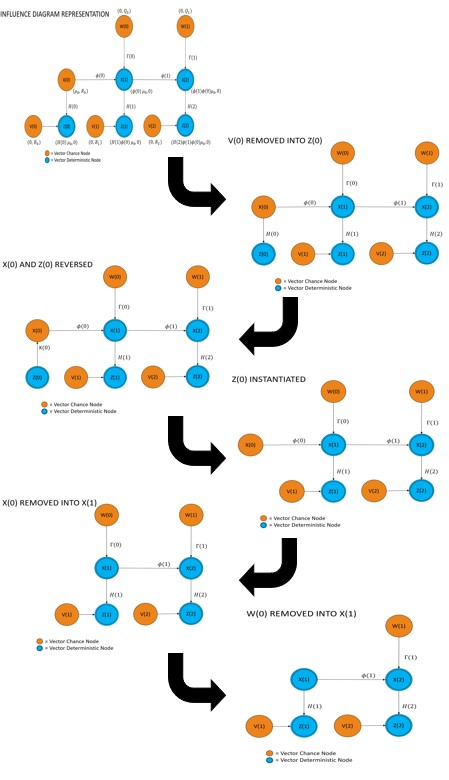
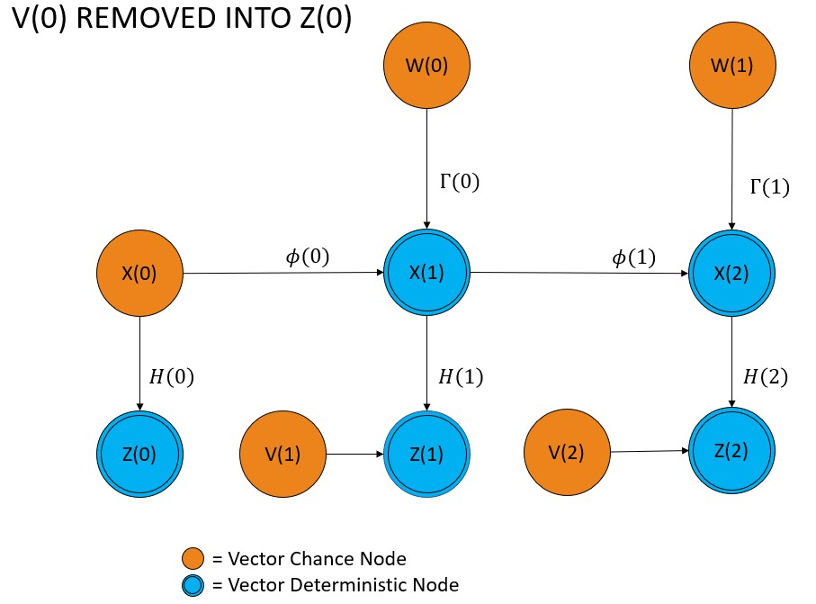
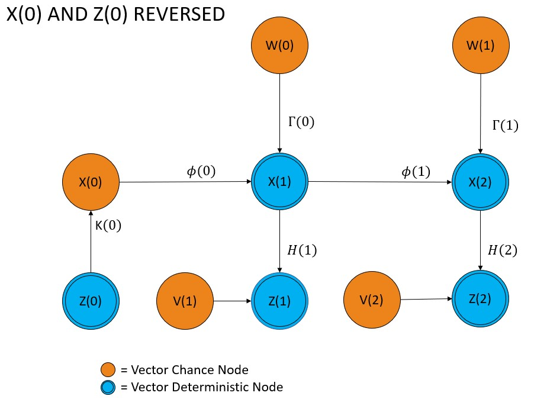
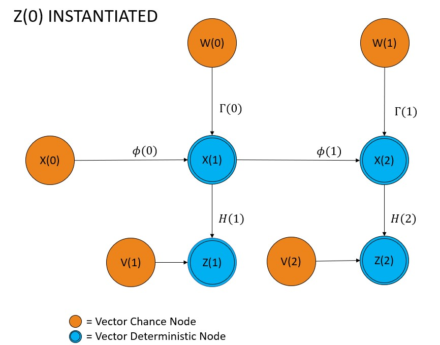
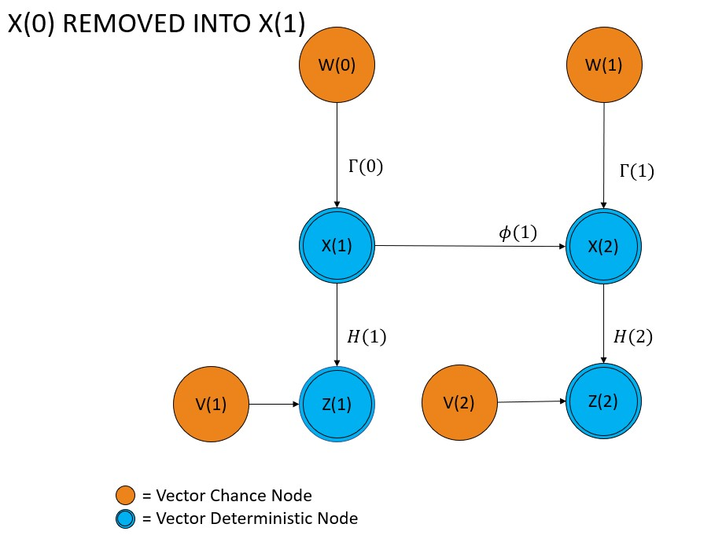
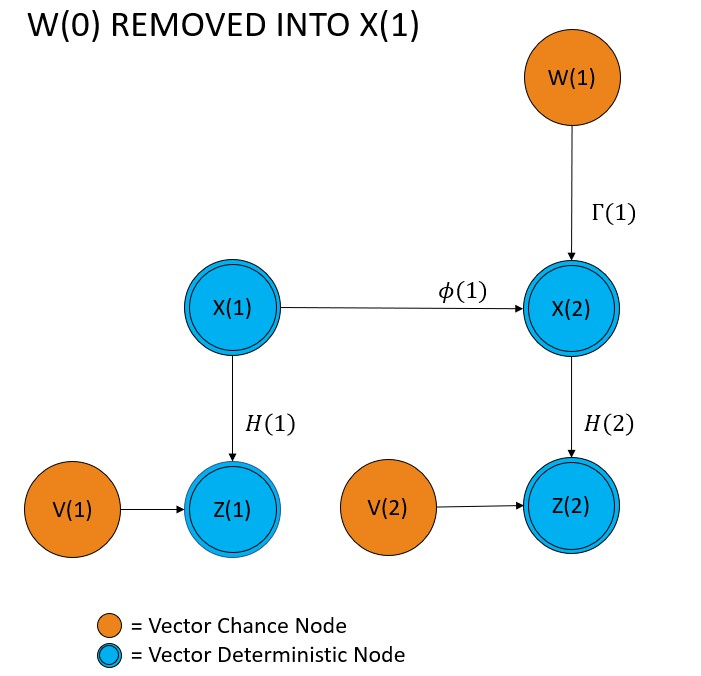
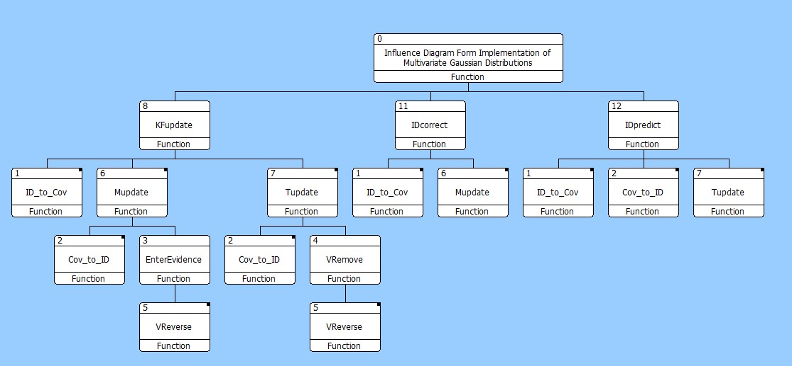

# Kalman-Filter-MATLAB-Functions
# Influence Diagram Implementation of Discrete-Time Filtering
This program is based on using normal influence diagrams as described in Kenley's doctoral dissertation (Kenley, Chapter 2) to perform optimal filtering and prediction for linear multistage processes according to the process model from Bryson and Ho’s book. (Bryson and Ho, 360)  The context and purpose for this application is summarized by Bryson and Ho:

> In practice, the individual state variables cannot be determined exactly by direct measurements; instead, we usually find that the measurements that can be made are functions of
> the state variables and that these measurements contain random errors. The system itself may also be subjected to random disturbances. In many cases, we have too few
> measurements at a given time to infer the state variables at that time, even if the measurements were quite precise. On occasion, we have more than enough measurements, so that
> the state variables are overdetermined. Thus, we are faced with the problem of making good estimates of the state variables from either too few or too many measurements, which
> are imprecise and only functions of the state variables, knowing, too, that the system itself is subjected to random disturbances. (Bryson and Ho 348)

The figure below breaks down this process into six stages that first updates the estimates of the state variables and then propagates the state variables forward in time.

## Stage 1

For Stage 1, the initial state of the system and measurement model are represented as an influence diagram where X(0) is the state variable at time step 0 with mean μ_0 and covariance P_0, H(0) is the measurement matrix, V(0) is the measurement noise with mean 0 and covariance R_0. Z(0) is the (conditional) measurement value, given that X(0) and V(0) are known, with conditional mean H(0)μ_0 and conditional covariance 0, which implies that the (conditional) measurement value is deterministic.
The initial state of the system and state propagation model are represented as an influence diagram where X(0) is the state variable at time step 0 with mean μ_0 and covariance P_0, Φ(0) is the state transition matrix, Γ(0) is the process noise matrix, W(0) is the process noise with mean 0 and covariance Q_0. X(1) is the (conditional) state variable at time step 1, given that X(0) and W(0) are known, with conditional mean Φ(0)μ_0 and conditional covariance 0, which implies that the (conditional) state variable at time step 1 is deterministic.

## Stage 2

For Stage 2, the measurement noise is accounted for by removing V(0) into the measurement value, Z(0). This is equivalent to marginalizing out the measurement noise.

## Stage 3

For Stage 3, the Kalman gain K(0) is calculated by reversing the arc between Z(0) and X(0), which is equivalent to applying Bayes' rule.

## Stage 4

For Stage 4, the measurement value Z(0) is instantiated to update the estimate of X(0).

## Stage 5

For Stage 5, the state vector X(0) is removed into X(1), which is the propagation of X(0) the state at time step 0 to the (conditional) state X(1) at time step 1, given that the process noise W(0) is known. This is equivalent to marginalizing out the state at time step 0.

## Stage 6

For Stage 6, the process noise is accounted for by removing W(0) into the state at time step 1, X(1). This is equivalent to marginalizing out the process noise.

# Program Overview
There are 10 MATLAB functions included in the System Function folder of this repository. The three main functions are KFupdate, IDcorrect and IDpredict; these are used to call the other functions and perform Kalman filtering. The hierarchical relationship between the three main functions and the other functions can be seen in the figure below where the numerical identifier for each function corresponds to a table in the Influence Diagram Algorithm Descriptions file from this repository. 

The purpose for the three main functions is as follows:
1.	KFupdate is an end-to-end execution of the six-stage process that first updates the estimates of the state variables and then propagates the state variables forward in time. It can accept inputs in influence diagram form used in Kenley's doctoral dissertation (Kenley, Chapter 2) or traditional covariance form used in Bryson and Ho’s book (Byron and Ho, 360). It can produce outputs in influence diagram form or traditional covariance form.
2.	IDcorrect executes the correct function of the MATLAB sensor fusion tracking toolbox. It accepts as input a trackingKF filter object as specified by MATLAB sensor fusion tracking toolbox and produces the output [xcorr,Pcorr] as specified by MATLAB sensor fusion tracking toolbox correct function.
3.	IDpredict executes the predict function of the MATLAB sensor fusion tracking toolbox. It accepts as input a trackingKF filter object as specified by MATLAB sensor fusion tracking toolbox and produces the output [xpred,Ppred] as specified by MATLAB sensor fusion tracking predict toolbox.

# References
Bryson, Arthur E., and Yu-Chi Ho. 1975. "Chapter 12: Optimal filtering and prediction." In Applied optimal control: optimization, estimation, and control, 348-389. Washington: Hemisphere.

Kenley, C. Robert. 1986. Influence diagram models with continuous variables. Doctoral Dissertation, Stanford University. Available at http://web.ics.purdue.edu/~ckenley/pubs/Kenley1986.pdf

Mathworks. 2020. "correct." Accessed July 7, 2020. https://www.mathworks.com/help/fusion/ref/trackingekf.correct.html.

—. 2020. "predict." Accessed July 7, 2020. https://www.mathworks.com/help/fusion/ref/trackingekf.predict.html.

—. 2020. "trackingKF." Mathworks Help Center. Accessed July 7, 2020. https://www.mathworks.com/help/fusion/ref/trackingkf.html.

